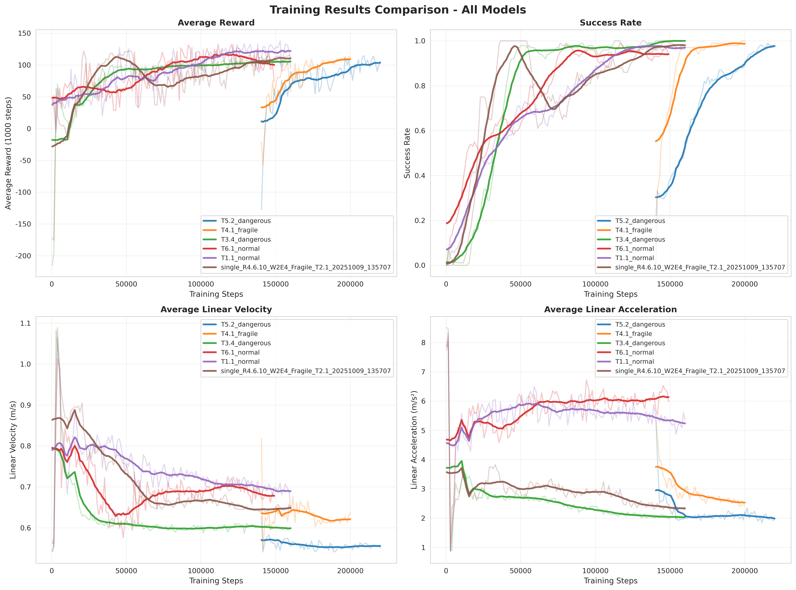
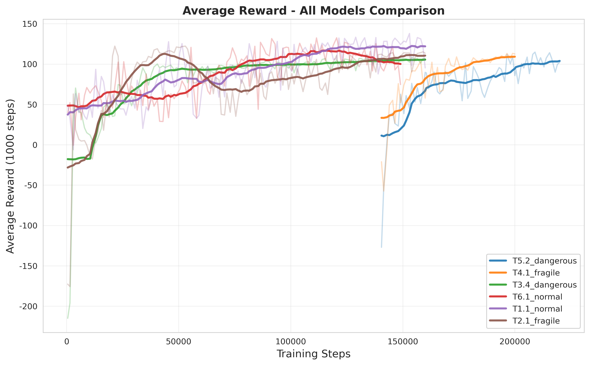
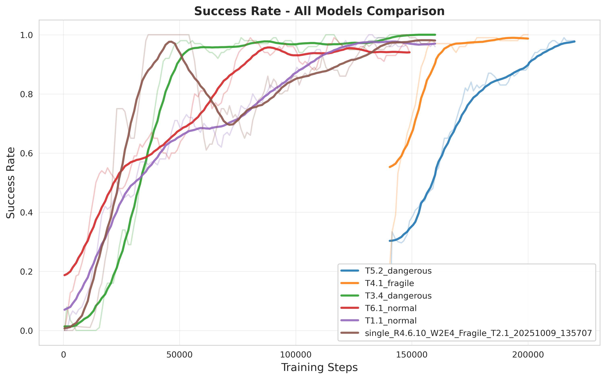
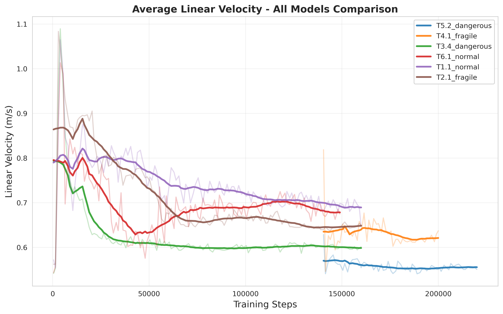
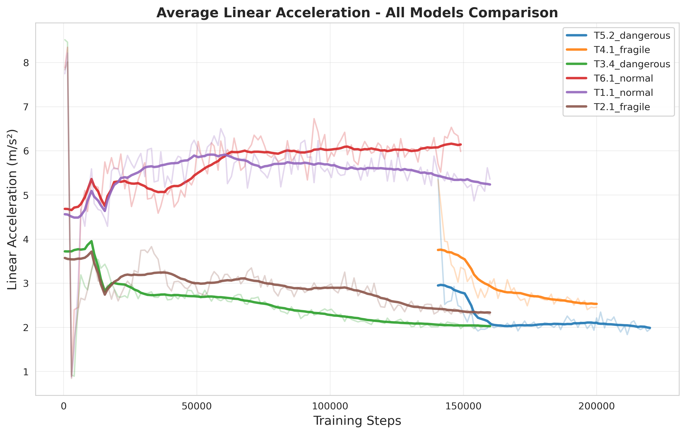

# ROSbot 导航系统：基于强化学习的端到端解决方案

本项目旨在通过深度强化学习，赋予 ROSbot 在复杂动态环境中自主导航的能力。我们基于 Stable-Baselines3 框架，实现了 TD3 算法，并在 Webots 仿真环境中进行了大量的训练与验证。

## 技术选型

*   **仿真平台:** Webots
*   **实验追踪:** MLflow
*   **核心算法:** TD3 (Twin Delayed Deep Deterministic Policy Gradient)

### 训练策略

我们摒弃了单一难度的训练方式，设计了可配置的课程学习体系，旨在引导智能体循序渐进地掌握复杂技能。

*   **垂直课程：动态障碍物递增**
    我们定义了一个基于全局训练步数的“难度时间表” (`obstacle_curriculum_steps` & `obstacle_curriculum_counts`)。随着训练的深入，环境中的障碍物数量会增加，使智能体从简单的避障学起，逐步适应更拥挤、更复杂的场景。

*   **阶段锁定机制 (`--lock_obstacles_per_stage`)**
    这是我们课程学习设计的关键。当启用此模式时，进入下一个难度阶段后，系统并不会生成一组全新的随机障碍物。相反，它会**在前一阶段已有的障碍物集合基础上，新增一个或多个障碍物**。这种“累加式”的难度增长，确保了模型在探索新技能的同时，不会“遗忘”已经掌握的简单场景，极大地提升了学习的稳定性和连续性。

### 奖励工程：面向行为的精细化塑造

奖励函数设计为多个子项的加权和，每一项都针对一个特定的行为目标，并且其权重均可通过命令行参数 (`--<reward_name>_k`) 进行精细调整。

*   **目标导向奖励**
    *   `--distance_k`: 鼓励智能体不断接近目标点。
    *   `--angle_reward_k`: 鼓励智能体使其朝向与目标方向保持一致，减少无效的侧向移动。
    *   `--directional_movement_k`: 直接奖励朝向目标方向的移动分量，确保每一步都在“做有用功”。

*   **安全与效率奖励**
    *   `--wall_proximity_penalty_k`: 对靠近墙壁或障碍物的行为施加惩罚，是保证安全的核心。
    *   `--time_k`: 对每一步施加微小的负奖励，以鼓励智能体寻找更短的路径，提高效率。

*   **行为平滑性与探索奖励**
    *   `--early_spin_penalty_k`: 抑制在起点附近的原地打转行为，鼓励智能体快速开始有效探索。
    *   `--front_clear_k`: 奖励前方开阔无障碍的区域，引导智能体向更安全的方向探索。

### 实验的可复现性与深度分析

*   **MLflow 全方位追踪:** 训练脚本与 MLflow 深度集成。每次运行，不仅会自动记录所有超参数和性能指标，**还会将当前版本的训练脚本和整个 `src` 目录作为“物料” (Artifacts) 上传**。这保证了任何一次实验结果都具备完全的可追溯性和可复现性。

*   **轨迹可视化与数据导出:** 在每个回合结束后，系统会自动生成并保存一张包含机器人路径、奖励分布、起点、终点和障碍物布局的详细轨迹图。这些可视化结果对于调试和直观理解智能体行为至关重要。同时，原始轨迹数据也会被导出为 `.csv` 和 `.jsonl` 文件，便于进行更深入的离线数据分析。

## 使用指南

1.  **环境配置:**
    ```bash
    git clone <your-repo-url>
    cd RL_car
    pip install -r requirements.txt
    ```

2.  **开始训练:**
    参数配置在args部分，您可以在train_single.py中修改

    ```bash
    python rosbot_navigation/train_single.py
    ```

3.  **评估模型:**
    使用 `test_model_webots.py` 脚本来加载并评估您训练好的模型。

    ```bash
    python rosbot_navigation/test_model_webots.py
    ```

## 模型表现

本项目训练了多个模型版本，针对不同货物类型（normal、fragile、dangerous）进行了优化。以下是各模型的训练曲线对比：

### 综合训练结果对比

下图展示了所有模型在四个关键指标上的表现对比，包括平均奖励、成功率、平均线速度和平均线加速度：



### 各指标详细对比

#### 平均奖励（Average Reward）



#### 成功率（Success Rate）



#### 平均线速度（Average Linear Velocity）



#### 平均线加速度（Average Linear Acceleration）



### 训练结果统计

各模型的最终性能指标如下（详见 `training_result/plots/training_statistics.csv`）：

| 模型 | 最终奖励 | 最终成功率 |
|------|---------|---------|
| T5.2_dangerous | 102.25 | 98.0% |
| T4.1_fragile | 112.45 | 100.0% |
| T3.4_dangerous | 106.44 | 100.0% |
| T6.1_normal | 74.61 | 94.0% |
| T1.1_normal | 95.25 | 96.0% |
| T2.1_fragile | 113.42 | 98.0% |

**关键发现：**
- Fragile 类型模型（T4.1、T2.1）表现最为稳定，成功率最高
- Dangerous 类型模型在平均加速度上表现更优（更平滑的运动控制）
- Normal 类型模型在峰值性能上表现突出，但稳定性略低
