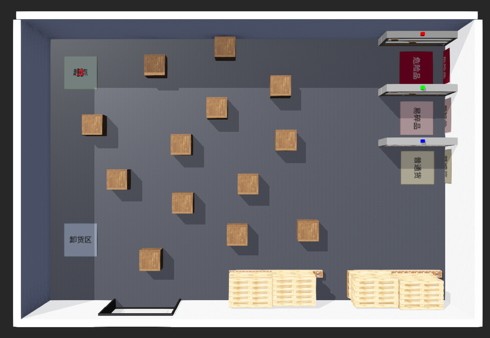
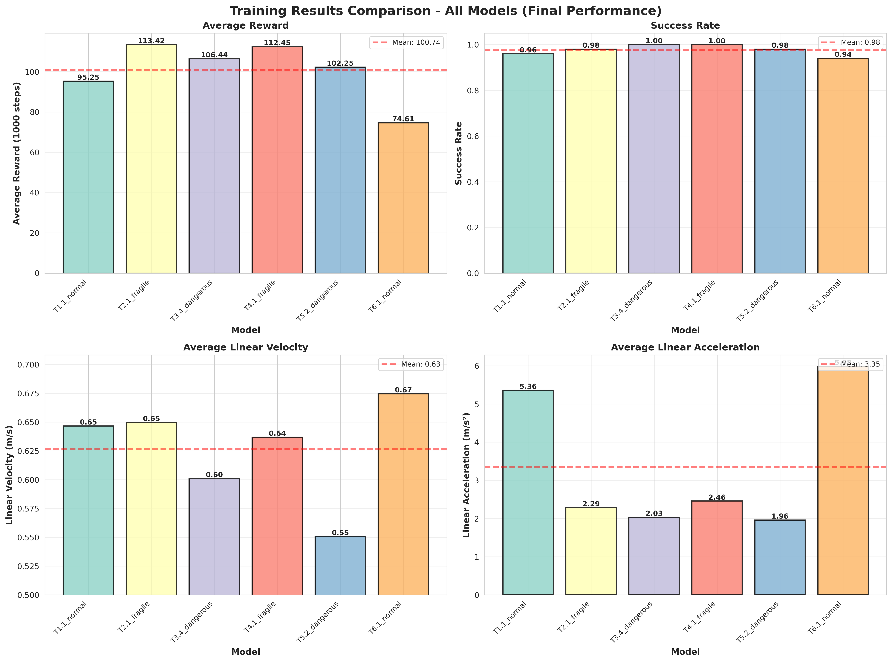
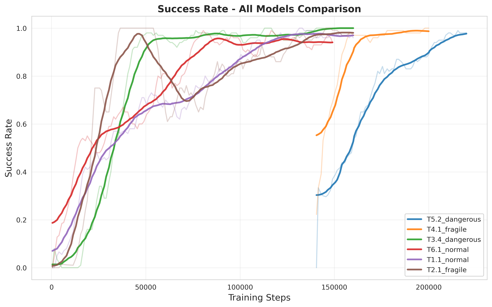

# 基于TD3算法和课程学习的导航

本项目旨在通过深度强化学习，赋予 Rosbot 在复杂动态环境中自主导航的能力。我们基于 Stable-Baselines3 框架，使用 TD3 算法，在 Webots 仿真环境中进行训练与验证。



## 技术选型

*   **仿真平台:** Webots
*   **实验追踪:** MLflow
*   **核心算法:** TD3 (Twin Delayed Deep Deterministic Policy Gradient)

### 训练策略

我们摒弃了单一难度的训练方式，设计了可配置的课程学习体系，旨在引导智能体循序渐进地掌握复杂技能。

*   **垂直课程：动态障碍物递增**
    我们定义了一个基于全局训练步数的“难度时间表” (`obstacle_curriculum_steps` & `obstacle_curriculum_counts`)。随着训练的深入，环境中的障碍物数量会增加，使智能体从简单的避障学起，逐步适应更拥挤、更复杂的场景。

*   **阶段锁定机制 (`--lock_obstacles_per_stage`)**
    这是我们课程学习设计的关键。当启用此模式时，进入下一个难度阶段后，系统并不会生成一组全新的随机障碍物。相反，它会**在前一阶段已有的障碍物集合基础上，新增一个或多个障碍物**。这种“累加式”的难度增长，确保了模型在探索新技能的同时，不会遗忘已经掌握的简单场景，极大地提升了学习的稳定性和连续性。

### 奖励设计

奖励函数设计为多个子项的加权和，每一项都针对一个特定的行为目标，并且其权重均可通过命令行参数 (`--<reward_name>_k`) 进行精细调整。

*   **目标导向奖励**
    *   `--distance_k`: 鼓励智能体不断接近目标点。
    *   `--angle_reward_k`: 鼓励智能体使其朝向与目标方向保持一致，减少无效的侧向移动。
    *   `--directional_movement_k`: 直接奖励朝向目标方向的移动分量，确保每一步都在“做有用功”。

*   **安全与效率奖励**
    *   `--wall_proximity_penalty_k`: 对靠近墙壁或障碍物的行为施加惩罚，是保证安全的核心。
    *   `--time_k`: 对每一步施加微小的负奖励，以鼓励智能体寻找更短的路径，提高效率。

*   **行为平滑性与探索奖励**
    *   `--early_spin_penalty_k`: 抑制在起点附近的原地打转行为，鼓励智能体快速开始有效探索。
    *   `--front_clear_k`: 奖励前方开阔无障碍的区域，引导智能体向更安全的方向探索。

### 实验的可复现性与深度分析

*   **MLflow 全方位追踪:** 训练脚本与 MLflow 深度集成。每次运行，不仅会自动记录所有超参数和性能指标，**还会将当前版本的训练脚本和整个 `src` 目录作为Artifacts上传**。这保证了任何一次实验结果都具备完全的可追溯性和可复现性。

*   **轨迹可视化与数据导出:** 在每个回合结束后，系统会自动生成并保存一张包含机器人路径、奖励分布、起点、终点和障碍物布局的详细轨迹图。这些可视化结果对于调试和直观理解智能体行为至关重要。同时，原始轨迹数据也会被导出为 `.csv` 和 `.jsonl` 文件，便于进行更深入的离线数据分析。

## 使用指南

1.  **环境配置:**
    ```bash
    git clone <your-repo-url>
    cd RL_car
    pip install -r requirements.txt
    ```
    或者使用docker，运行前请修改docker_run.sh中的路径
    ```bash
    cd docker
    docker build -f webots.dockerfile -t rl_car .
    bash docker_run.sh
    ```
2.  **开始训练:**
    参数配置在args部分，您可以在train_single.py中修改

    ```bash
    python rosbot_navigation/train_single.py
    ```

3.  **评估模型:**
    使用 `test_model_webots.py` 脚本来加载并评估您训练好的模型。

    ```bash
    python rosbot_navigation/test_model_webots.py
    ```

4. **运行识别服务与监控服务**\
    [See RL_Flow/README.md](RL_Flow/README.md)

## 模型表现

本项目训练了多个模型版本，针对不同货物类型（normal、fragile、dangerous）和任务需求进行了优化。基于 Release 4.6.10 版本，我们使用课程学习策略和阶段锁定机制，成功训练出了多个高性能导航模型。

### 训练模型详解

#### T1.1 - Normal 导航模型
**任务:** 从出发点到三个取货点，再从normal取货点到卸货点 \
**特点:** 基础模型

#### T6.1 - Normal 导航模型
**任务:** 从出发点到三个取货点，从三个取货点到卸货点 \
**特点:** 基础模型，将所有任务都纳入训练

#### T2.1 - Fragile 导航模型
**任务:** 从fragile取货点到卸货点，从头训练 \
**特点:** 运动平滑，适合运输易碎物品

#### T3.4 - Dangerous 导航模型
**任务:** 从dangerous取货点到卸货点，从头训练 \
**特点:** 运动平滑基础上进一步降低速度，增加安全性

#### T4.1 - Fragile 导航微调模型
**任务:** 从fragile取货点到卸货点，在T6.1的基础上微调 \
**特点:** 在已有基础模型上进行微调，通过迁移学习获得更快的训练收敛速度和更好的性能

#### T5.2 - Dangerous 导航微调模型
**任务:** 从dangerous取货点到卸货点，在T6.1的基础上微调 \
**特点:** 在已有基础模型上进行微调，通过迁移学习获得更快的训练收敛速度和更好的性能

### 训练结果统计

各模型的最终性能指标如下（详见 [training_result/plots/training_statistics.csv](training_result/plots/training_statistics.csv)）：

| 模型 | 最终奖励 | 最终成功率 |
|------|---------|---------|
| T5.2_dangerous | 102.25 | 98.0% |
| T4.1_fragile | 112.45 | 100.0% |
| T3.4_dangerous | 106.44 | 100.0% |
| T6.1_normal | 74.61 | 94.0% |
| T1.1_normal | 95.25 | 96.0% |
| T2.1_fragile | 113.42 | 98.0% |


### 综合训练结果对比

下图展示了所有模型在四个关键指标上的表现对比，包括平均奖励、成功率、平均线速度和平均线加速度：



### 各指标详细对比

#### 平均奖励（Average Reward）


#### 成功率（Success Rate）



#### 平均线速度（Average Linear Velocity）


#### 平均线加速度（Average Linear Acceleration）


